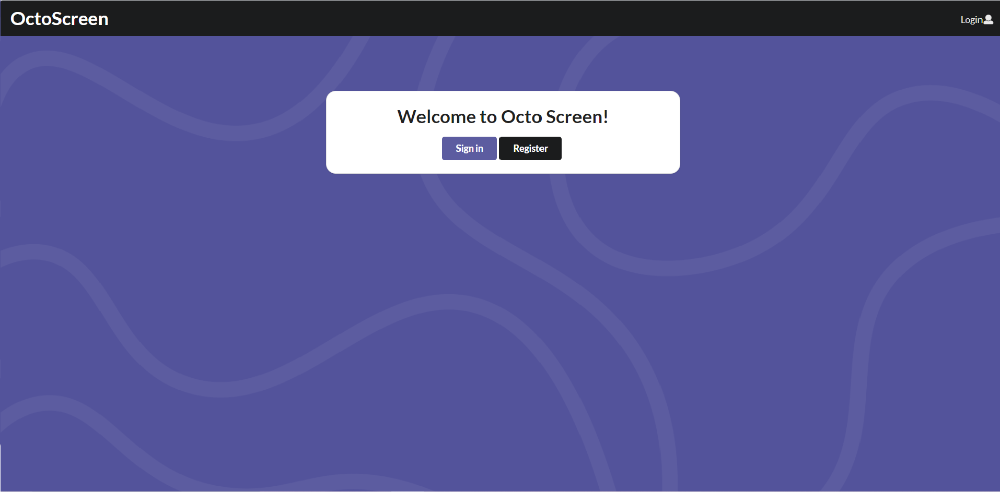
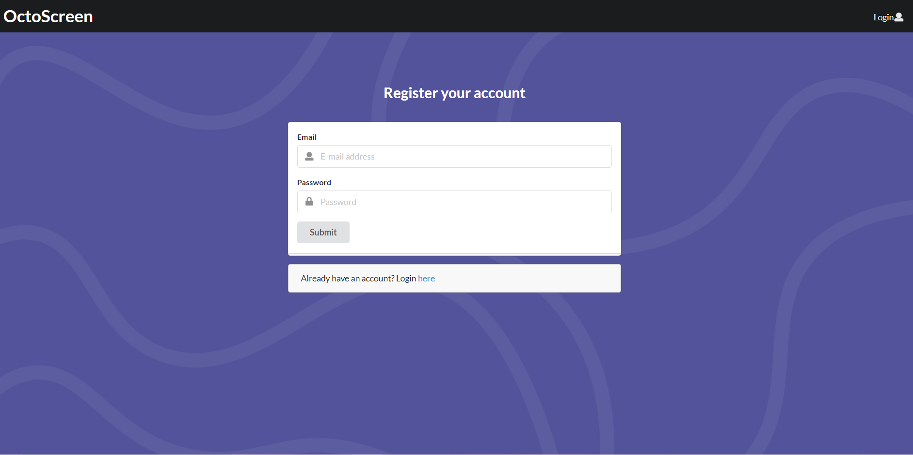
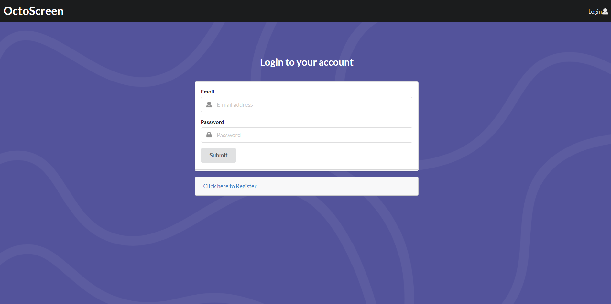
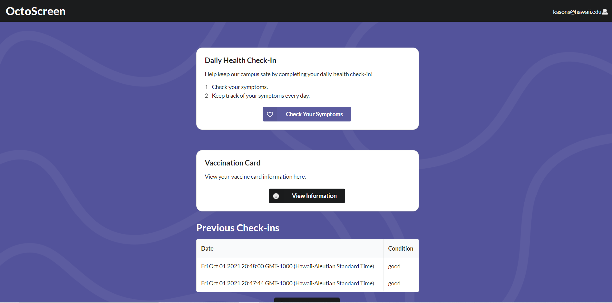
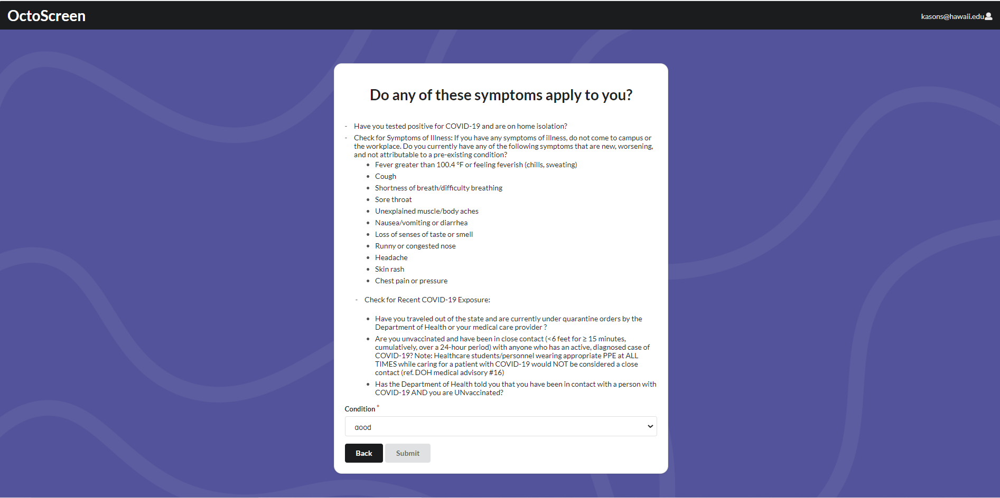
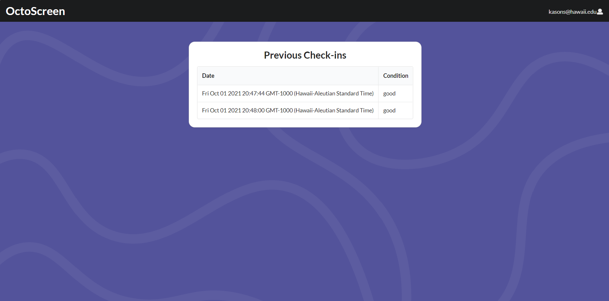
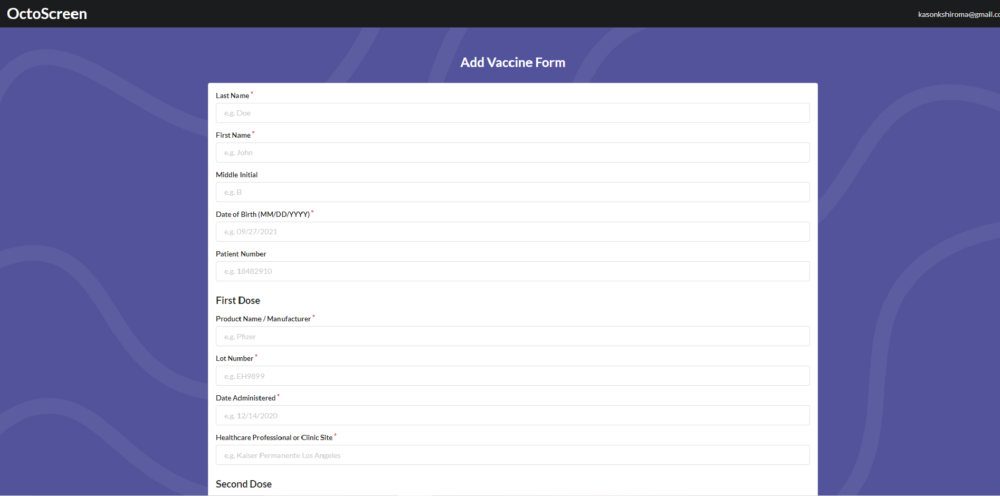
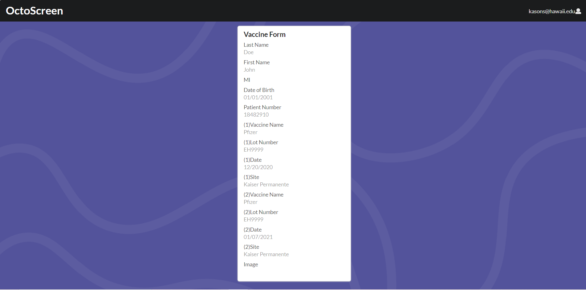
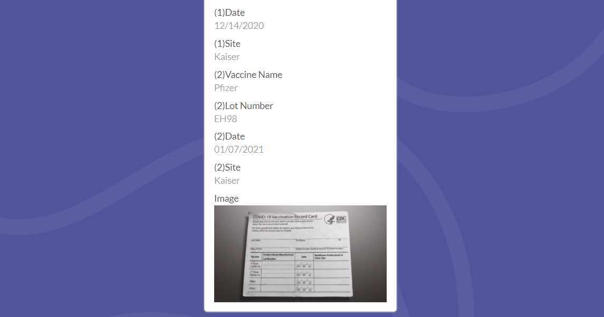

# Octo Screen

# Table of Contents

* [About Octo Screen](#about-octo-screen)
* [Deployment Link](#deployment-link)
* [Pages](#pages)
* [The Team](#the-team)

## About Octo Screen
Octo Screen is our app for keeping track of COVID among our users. When complete, users can use Octo Screen to indicate if they have COVID symptoms daily, check their record of previous check-ins, as well as upload their vaccination status.

## Deployment Link
[to Octo Screen](https://octo-screen.meteorapp.com/#/)

## Pages

### Landing Page

This is the first page users see when they access the app. From here, they can either sign in if they have an account, or register an account if they don't have one.

### Register Page

Users can register in this page.

### Sign in Page

Users can sign in on this page.

### Home Page

Once the user signs in, this is the main page where users can do their daily check-in, update vaccination status or view their check-in history.

### Check in Page

In this page, users can indicate whether they are experiencing COVID symptoms or not.

### Check in History Page

In this page, users can see a history of their previous check-ins

### Vaccination Form

This page displays a form, where the user can input their vaccine information.

### Vaccination Info Page

This page displays the users vaccine information.

### Vaccination Card Image

At the bottom of the vaccine info page, you can see image of the users vaccination card if provided.

## The Team
- Jason Kulka
- Kason Shiroma
- Keanu Lagundimao
- Derek Nishimoto
