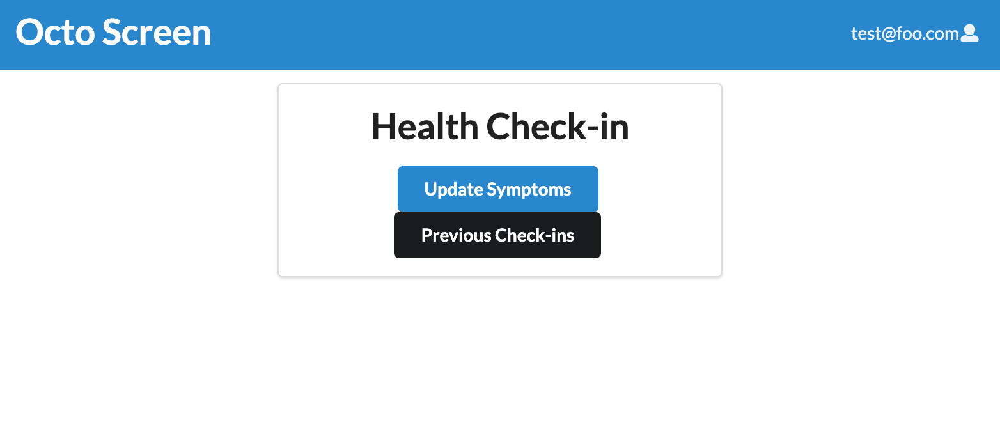

# Octo Screen

# Table of Contents

* [About Octo Screen](#about-octo-screen)
* [Deployment Link](#deployment-link)
* [Pages](#pages)
* [The Team](#the-team)

## About Octo Screen
Octo Screen is our app for keeping track of COVID among our users. When complete, users can use Octo Screen to indicate if they have COVID symptoms daily, check their record of previous check-ins, as well as upload their vaccination status.

## Deployment Link
[to Octo Screen]()

## Pages

This is the first page users see when they access the app. From here, they can either sign in if they have an account, or register an account if they don't have one.

Users can register in this page.

Users can sign in on this page.

This is the page users go to after signing in, allowing them to either do their daily check-in or check their check-in history.

In this page, users can indicate whether they are experiencing COVID symptoms or not.

In this page, users can see a history of their previous check-ins

## The Team
- Jason Kulka
- Kason Shiroma
- Keanu Lagundimao
